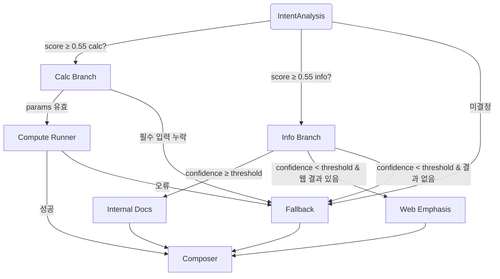

# LangGraph 워크플로 다이어그램

- [x] Mermaid 다이어그램 추가
- [x] 노드/엣지 정의, 분기 흐름 명시
- [x] OrchestrationState 주요 필드 표기
- [x] 노드별 입력/출력/실패 핸들링 요약
- [x] 변경 시 검증 절차 기록

## 상태 모델
- `intent`, `mode`, `slots`, `documents`, `web_results`, `calc`, `confidence`, `errors`, `metrics`
- `metrics.latency_ms`: intent_analysis, retrieval, compute, route, composer 단계별 ms
- `metrics.token_usage`: retrieval/compute 사용 토큰 기록

## 노드별 요약
- **IntentAnalysis**
  - 입력: 사용자 질의
  - 출력: intent/slots/confidence
  - 실패 시 fallback 코드 `intent_resolution_failed`
- **Info Branch**
  - 입력: intent=info, category
  - 처리: RetrievalRunner 호출, confidence 점검, low-score 시 웹 검색 우선
  - 실패 시 `retrieval_error` 또는 `retrieval_low_confidence`
- **Calc Branch**
  - 입력: intent=calc, params
  - 처리: 필수 파라미터 검증 후 ComputeRunner 실행
  - 실패 시 `missing_params` 또는 `compute_error`
- **Fallback**
  - 공통 fallback 메시지와 오류 코드 기록, composer가 안내문 생성
- **Composer**
  - 정보형: 내부 문서 bullet → 웹 보강 → 출처 링크
  - 계산형: summary/정책/상환/가정 bullet + 면책 문구

## 변경 및 검증
1. router/composer/state 수정 시 이 문서와 prompts 동시 업데이트
2. 주요 시나리오(info 성공, info 웹 fallback, calc 성공, calc 실패)로 스모크 테스트
3. `metrics.collect_metrics()` 호출로 latency/token 기록이 누락되지 않았는지 확인
